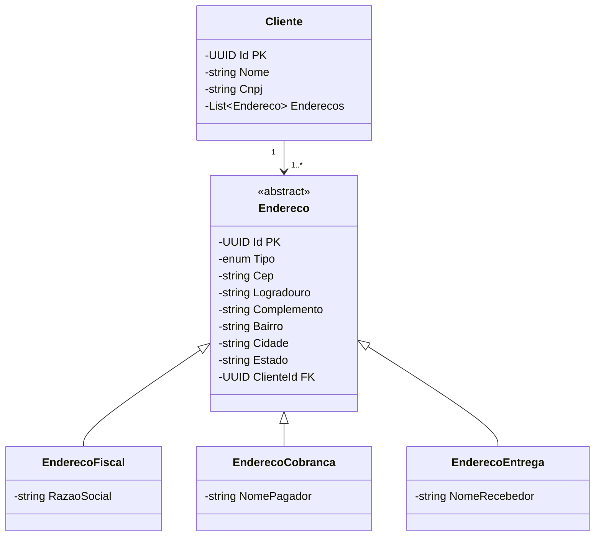

# Gerenciamento de Clientes
API CRUD de Clientes | ASP.NET MVC | C# | DevExpress | SQL Server | EntityFramework | Modelagem DDD

## Imagens da Aplicação


## Dependências
```powershell
   [net8.0]: 
   Top-level Package                              Requested   Resolved
   > DevExtreme.AspNet.Core                       24.1.6      24.1.6  
   > DevExtreme.AspNet.Data                       4.0.1       4.0.1   
   > Microsoft.EntityFrameworkCore                8.0.10      8.0.10  
   > Microsoft.EntityFrameworkCore.SqlServer      8.0.10      8.0.10  
   > Microsoft.EntityFrameworkCore.Tools          8.0.10      8.0.10  
```

## Banco de Dados
### Modelagem UML

### SQL Selections
Na raíz do projeto está um arquivo SQL com alguns Selects úteis:
```sql
USE [crud-cliente]

SELECT * FROM Clientes;
SELECT * FROM Enderecos;

-- Seleção dos clientes e seus respectivos Endereços
SELECT c.Nome as NOME_CLIENTE, e.Cep as CEP_ENDERECO
FROM Clientes c
INNER JOIN Enderecos e ON c.Id = e.ClienteId;

-- Seleção dos Endereços Fiscais
SELECT * FROM Enderecos e
WHERE e.Discriminator = 'EnderecoFiscal';

-- Seleção dos Endereços de Cobrança
SELECT * FROM Enderecos e
WHERE e.Discriminator = 'EnderecoCobranca';

-- Seleção dos Endereços de Entrega
SELECT * FROM Enderecos e
WHERE e.Discriminator = 'EnderecoEntrega';
```

### Iniciar Banco de Dados SQL Server
Com o pacote `Microsoft.EntityFrameworkCore.Tools` instalado, executar o comando
```powershell
Update-Database
```
no Gerenciador de Pacotes NuGet
