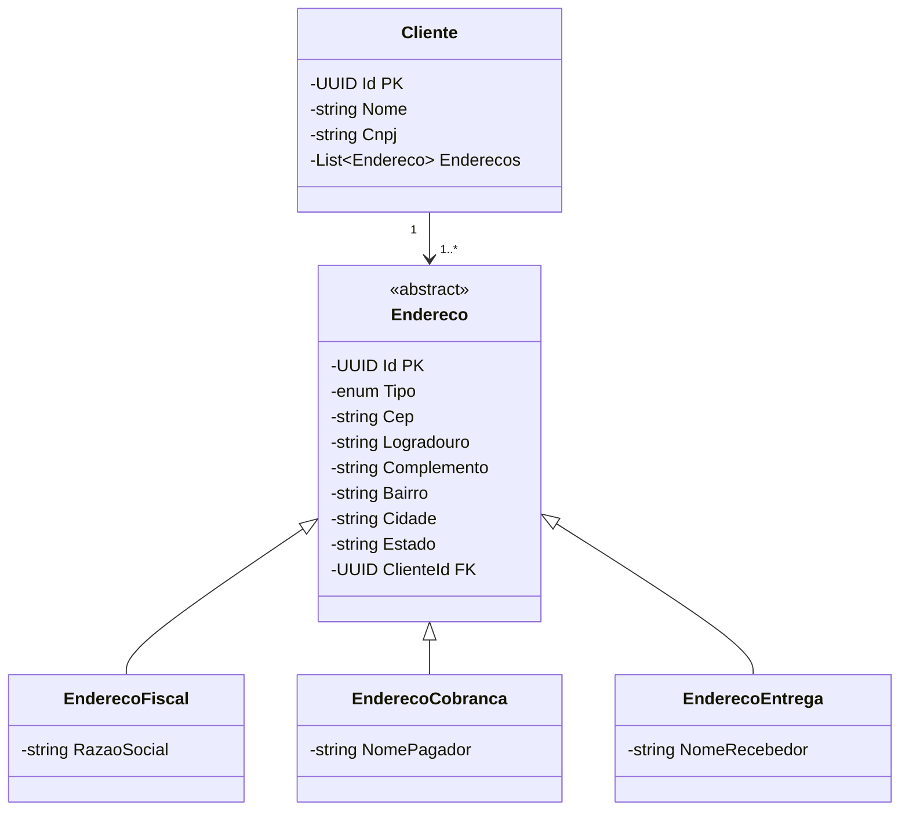

# Gerenciamento de Clientes
API CRUD de Clientes | ASP.NET MVC | C# | DevExpress | SQL Server | EntityFramework | Modelagem DDD

## Dependências
```powershell
   [net8.0]: 
   Top-level Package                              Requested   Resolved
   > DevExtreme.AspNet.Core                       24.1.6      24.1.6  
   > DevExtreme.AspNet.Data                       4.0.1       4.0.1   
   > Microsoft.EntityFrameworkCore                8.0.10      8.0.10  
   > Microsoft.EntityFrameworkCore.SqlServer      8.0.10      8.0.10  
   > Microsoft.EntityFrameworkCore.Tools          8.0.10      8.0.10  
```

## Banco de Dados
### Modelagem UML

### Iniciar Banco de Dados SQL Server
Com o pacote `Microsoft.EntityFrameworkCore.Tools` instalado, executar o comando
```powershell
Update-Database
```
no Gerenciador de Pacotes NuGet
